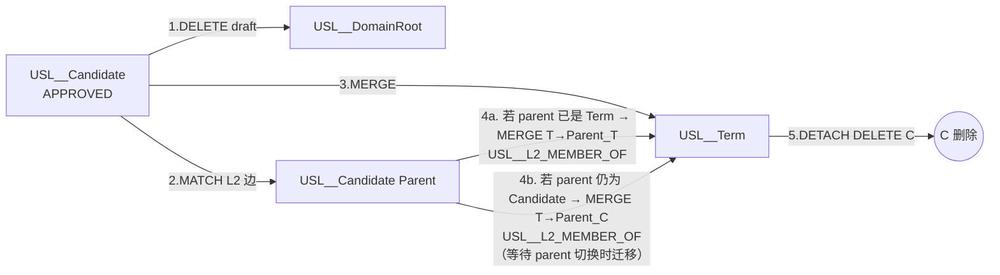

# Contract: Neo4j `USL__*` 命名空间规范 —— 节点/边/索引 + 原子切换 Cypher 片段

**Location**:
- 命名空间前缀定义常量: `odap/biz/semantic_admin/candidate_store/impl/constants.py`（`USL_NS = "USL__"`）
- 初始化脚本: `odap/biz/semantic_admin/candidate_store/impl/neo4j_init_namespace.py`（首次启动或 seed 时执行 §2 索引创建）
- 实现类: `candidate_store/impl/neo4j_schema_graph_writer.py`（§3/§4/§5 写）+ `usl_writeback/impl/writeback_service_impl.py::_neo4j_finalize_switch`（§6 切换）

**命名原则**：所有 USL 管理后台相关的 Neo4j 实体**必须**以 `USL__` 前缀区分命名空间，与 Graphiti 本体正式图（通常无前缀或 `OG__` / `ONT__`）、审计图（`audit_`，对齐 project_memory graph_audit 规则）等完全隔离。graph_audit() 对 `USL__*` 前缀的节点/边**不**触发自动审计（避免 candidate 写入无限递归）。

---

## Section 1: 命名规范速查（6 节点 / 5 边 / 2 域根）

```text
┌────────────────────────────────────────────────────────────────────────┐
│  命名总原则                                                            │
│  1. 标签/类型统一 PascalCase：`USL__<EntityName>`                      │
│  2. 边类型统一 SCREAMING_SNAKE_CASE：`USL__<EDGE_NAME>`                │
│  3. 属性键统一 snake_case（与 SQLite 列一致）                           │
│  4. 禁止跨命名空间直接建边；如需与 Graphiti Ontology 正式图沟通，       │
│     一律通过 WRITEBACK 阶段先写 USL 侧，再调 ontology_tbox_writer       │
│     写到正式命名空间（两阶段写，避免 Neo4j 级联污染）                    │
└────────────────────────────────────────────────────────────────────────┘
```

### 1.1 节点标签（6 类 + 1 虚拟根）

| 标签 | 说明 | 典型生命周期 | 写回操作 |
|------|------|-------------|---------|
| **`USL__DomainRoot`** | 语义域虚拟根节点（1 domain = 1 节点） | 永久（对应 usl_domains 行创建） | 不写回 |
| **`USL__Candidate`** | 候选术语节点（L1~审批中，未通过） | SUBMITTED → AUDITOR_REVIEW → **APPROVED 写回时删除** | §6 原子切换：DETACH DELETE |
| `USL__Term` | 正式术语节点（写回成功后存在） | 永久（对应 usl_terms.is_deprecated=0 的行） | —（终点） |
| `USL__Stoplisted` | 附加标签：拒绝候选被加入黑名单（**同节点同时移除 `:USL__Candidate` 标签**） | 永久 | —（终态） |
| `USL__Duplicate` | 附加标签：候选被标记为 DUPLICATE（原 USL__Candidate 仍存，用于审计追溯） | 永久 | —（终态） |
| `USL__Rejected` | 附加标签：拒绝候选未进黑名单但保留 | 永久 | —（终态） |

### 1.2 边类型（5 类）

| 边类型 | 起点 → 终点 | 说明 | 对应 SQLite |
|--------|------------|------|------------|
| **`USL__IS_A_DRAFT`** | `USL__Candidate` → `USL__DomainRoot` | 草稿归属边；写回成功 / 拒绝 purge 时**必须删除** | schema_candidates.domain_id |
| **`USL__L2_MEMBER_OF`** | `USL__Candidate/Term` → `USL__Candidate/Term` | L2 层级归属（等价于 is_a 草稿或正式） | usl_term_hierarchies where hierarchy_type='is_a' |
| `USL__HAS_SYNONYM` | `USL__Candidate/Term` → (:USL__Synonym 虚拟节点) | 可选：同义词图视图；为避免 N+1 通常只在 Neo4j 上按需生成，不做主路径 | usl_term_synonyms |
| `USL__CROSS_DOMAIN_MAP` | `USL__Term` → `USL__Term` | 跨域映射 SKOS: exactMatch/closeMatch/broadMatch/...（写回后生成） | usl_cross_domain_mappings |
| `USL__WRITEBACK_FROM` | `USL__Term` → `USL__Candidate`（若保留审计） | 仅"保留候选不删除"场景下使用，追踪 lineage；默认 §6 走 DELETE，此边启用时才建立 | schema_candidates.merged_into_term_id |

### 1.3 属性命名约定（所有 `USL__` 节点共享）

| 属性键 | 类型 | 必填 | 说明 |
|--------|------|:----:|------|
| `id` | TEXT | ✅ | UUID；与 SQLite schema_candidates.id / usl_terms.id 完全一致 |
| `domain_id` | TEXT | ✅ | usl_domains.code 或 id；用于过滤 + 索引 |
| `canonical_name` | TEXT | ✅ | 规范名（对应 usl_terms.canonical_name） |
| `proposed_name` | TEXT | Candidate 侧 ✅ | 展示名（Term 侧通常 = canonical_name 或另存 display_name） |
| `status` / `lifecycle_status` | TEXT | ✅ | lifecycle_status.value；便于 Cypher 直接过滤 DRAFT/APPROVED |
| `confidence` | FLOAT | 可选 | 抽取置信度 [0,1] |
| `quality_total_score` | FLOAT | 可选 | 质量闸总分 [0,1]（快速加速通道过滤） |
| `quality_level` | TEXT | 可选 | HIGH / MEDIUM_HIGH / MEDIUM / LOW（对齐 quality_reports.quality_level） |
| `pipeline_run_id` | TEXT | 可选 | 来源 pipeline_runs.id |
| `origin_layer` | TEXT | Candidate 侧 ✅ | "L1" / "L2"（对齐 schema_candidates.origin_layer） |
| `created_at` / `updated_at` | TEXT (ISO) | ✅ | 时间戳；对齐 SQLite 列 |
| `written_back_at` | TEXT (ISO) | Term 侧 ✅ | 写回成功时间（对应 schema_candidates.written_back_at） |
| `source_candidate_id` | TEXT | Term 侧 ✅ | 来源候选 ID（写回审计） |

---

## Section 2: 索引与唯一约束（首次部署执行，幂等 CREATE ... IF NOT EXISTS）

```cypher
/* ============================================================
 * 2.1 唯一约束（属性唯一，自动建 BTREE 索引）
 * ============================================================ */

-- 候选术语：ID 级唯一
CREATE CONSTRAINT usl_candidate_id IF NOT EXISTS
FOR (n:USL__Candidate) REQUIRE n.id IS UNIQUE;

-- 正式术语：ID 级唯一（写回时 usl_term_id 注入）
CREATE CONSTRAINT usl_term_id IF NOT EXISTS
FOR (n:USL__Term) REQUIRE n.id IS UNIQUE;

-- 域根：每个 domain 只一个虚拟根节点
CREATE CONSTRAINT usl_domain_root_code IF NOT EXISTS
FOR (n:USL__DomainRoot) REQUIRE n.domain_id IS UNIQUE;

/* ============================================================
 * 2.2 二级索引（列表查询 & 过滤）
 * ============================================================ */

-- 域过滤（所有查询的主维度）
CREATE INDEX usl_candidate_domain IF NOT EXISTS
FOR (n:USL__Candidate) ON (n.domain_id);

CREATE INDEX usl_term_domain IF NOT EXISTS
FOR (n:USL__Term) ON (n.domain_id);

-- 状态过滤（DRAFT/APPROVED/STOPLISTED ...）
CREATE INDEX usl_candidate_status IF NOT EXISTS
FOR (n:USL__Candidate) ON (n.lifecycle_status);

-- 质量水平 & 总分：加速通道 & 排序
CREATE INDEX usl_candidate_quality_level IF NOT EXISTS
FOR (n:USL__Candidate) ON (n.quality_level);

CREATE INDEX usl_candidate_quality_total IF NOT EXISTS
FOR (n:USL__Candidate) ON (n.quality_total_score);

-- 规范化名快速查重（L2 & quality_gate 用）
CREATE INDEX usl_candidate_canonical IF NOT EXISTS
FOR (n:USL__Candidate) ON (n.canonical_name);

CREATE INDEX usl_term_canonical IF NOT EXISTS
FOR (n:USL__Term) ON (n.canonical_name);

/* ============================================================
 * 2.3 文本索引（NLP 语义 & 前端搜索框）
 * ============================================================ */

CREATE TEXT INDEX usl_candidate_definition IF NOT EXISTS
FOR (n:USL__Candidate) ON (n.definition);

CREATE TEXT INDEX usl_term_description IF NOT EXISTS
FOR (n:USL__Term) ON (n.description, n.short_definition);

/* ============================================================
 * 2.4 边类型索引（大域下层级关系遍历）
 * ============================================================ */

CREATE INDEX usl_edge_draft IF NOT EXISTS
FOR ()-[r:USL__IS_A_DRAFT]->() ON (r.status);

CREATE INDEX usl_edge_l2_member IF NOT EXISTS
FOR ()-[r:USL__L2_MEMBER_OF]->() ON (r.hierarchy_level, r.confidence);
```

---

## Section 3: 候选写入：MERGE `USL__Candidate` + 属性白名单

（对齐 data-model.md §3 2.3 片段；实现于 `CandidateDualWriter.M3 write_neo4j_usl_candidate_node`）

```cypher
/* 3.1 幂等创建/更新候选节点 */
MERGE (c:USL__Candidate {id: $candidate_id})
SET
    c.domain_id            = $domain_id,
    c.canonical_name       = $canonical_name,
    c.proposed_name        = $proposed_name,
    c.l1_category          = $l1_category,
    c.l2_category          = $l2_category,
    c.lifecycle_status     = $status,                      -- SUBMITTED / AUDITOR_REVIEW / ...
    c.confidence           = $confidence,
    c.origin_layer         = $origin_layer,                 -- L1 / L2
    c.quality_total_score  = $quality_total_score,          -- 质量闸后回填
    c.quality_level        = $quality_level,                -- HIGH / MEDIUM / LOW ...
    c.source_document      = $source_document,              -- 证据
    c.pipeline_run_id      = $pipeline_run_id,
    c.created_at           = COALESCE(c.created_at, $created_at),   -- MERGE：首次写入时设置
    c.updated_at           = $updated_at
RETURN c.id AS node_id, elementId(c) AS element_id;
```

**属性白名单强制约束**：除上面列出的属性外，**禁止**在 `USL__Candidate` 节点上 SET 其他任意属性（以防止大 JSON payload 写入图数据库导致膨胀；完整 payload 只在 SQLite 存）。

---

## Section 4: L2 成员边写入 `USL__L2_MEMBER_OF`

（对齐 data-model.md §3 2.4；实现于 `CandidateDualWriter.M4 write_neo4j_l2_edges`）

```cypher
/* 4.1 幂等建立/更新 L2 层级边（每个 parent 调用一次，多 parent 在 Python 侧循环） */
MATCH (child:USL__Candidate {id: $child_candidate_id})
MATCH (parent:USL__Candidate {id: $parent_candidate_id})
MERGE (child)-[r:USL__L2_MEMBER_OF]->(parent)
SET
    r.hierarchy_level = 'L2',
    r.confidence      = $confidence,
    r.relation_type   = 'IS_A',
    r.created_at      = COALESCE(r.created_at, $created_at),
    r.updated_at      = $updated_at
RETURN type(r) AS edge_type, elementId(r) AS edge_element_id;
```

> 对缺失 parent 的容错：4.1 的 MATCH 失败不抛整体错；Python 侧记录 `parent_missing: [ids]` 到 result.error_message。

---

## Section 5: 草稿归属边 `USL__IS_A_DRAFT` 链接

（对齐 data-model.md §3 2.5；实现于 `CandidateDualWriter.M5 link_neo4j_draft_edge`）

```cypher
/* 5.1 在域根节点与候选之间建立草稿边
 *      - DomainRoot 不存在则自动 MERGE 创建
 *      - 同一 candidate 与 domain 仅一条草稿边（MERGE 幂等）
 */
MATCH (c:USL__Candidate {id: $candidate_id})
MERGE (domain_root:USL__DomainRoot {domain_id: $domain_id})
  ON CREATE SET
    domain_root.created_at = $created_at,
    domain_root.updated_at = $updated_at
MERGE (c)-[r:USL__IS_A_DRAFT]->(domain_root)
SET
    r.status      = $candidate_status,
    r.created_at  = COALESCE(r.created_at, $created_at),
    r.updated_at  = $updated_at
RETURN r.status AS draft_status, elementId(r) AS edge_element_id;
```

> **重要约束**：`WRITEBACK` 成功或候选被"拒绝 + purge"时**必须**删除该草稿边（否则 DomainRoot 上会累积大量孤儿 DRAFT 边，使得 "草稿箱"查询永远膨胀）。

---

## Section 6: 审批通过 → 从候选到正式术语的原子切换

（对齐 data-model.md §3 2.6；实现于 `UslWritebackService._neo4j_finalize_switch` success=True）

### 6.1 切换流程图



### 6.2 Cypher 实现（单事务内原子）

```cypher
/* === 步骤 0：MATCH 目标候选 === */
MATCH (c:USL__Candidate {id: $candidate_id})
WHERE c.lifecycle_status IN ['APPROVED', 'MERGED_INTO_USL']   /* 幂等保护：即使已切换也可安全重跑 */

/* === 步骤 1：删除草稿归属边（先删边避免后续删除节点时孤儿边） === */
OPTIONAL MATCH (c)-[draft_r:USL__IS_A_DRAFT]->()
DELETE draft_r

/* === 步骤 2~5：在同一 WITH 下将候选属性 → 正式节点 + 迁移 L2 边 + 删除 === */
WITH c, $final_term_id AS term_id, $written_back_at AS wb_at

/* MERGE 正式术语节点（保留 candidate.id 作为 source_candidate_id 映射） */
MERGE (t:USL__Term {id: term_id})
SET t.domain_id            = c.domain_id,
    t.canonical_name       = c.canonical_name,
    t.display_name         = COALESCE(c.proposed_name, c.canonical_name),
    t.l1_category          = c.l1_category,
    t.l2_category          = c.l2_category,
    t.status               = 'ACTIVE',
    t.source_candidate_id  = c.id,
    t.written_back_at      = wb_at,
    t.updated_at           = wb_at,
    t.created_at           = COALESCE(t.created_at, c.created_at)

/* === 迁移 L2 边：候选 child→parent_c  →  正式 t→parent 实际节点（无论其为 Candidate 或 Term） === */
WITH c, t
MATCH (c)-[l2:USL__L2_MEMBER_OF]->(parent_c:USL__Candidate)
MERGE (t)-[new_l2:USL__L2_MEMBER_OF]->(parent_parent:USL__Term {id: parent_c.id})
  ON CREATE SET new_l2 = properties(l2), new_l2.migrated_from_candidate = true
  ON MATCH  SET new_l2 = properties(l2), new_l2.migrated_from_candidate = true
/* 若 parent 还没写回，也允许暂时挂到 USL__Candidate parent 上作为占位： */
WITH c, t, count(new_l2) AS cnt_migrated
MATCH (c)-[l2b:USL__L2_MEMBER_OF]->(parent_c2:USL__Candidate)
WHERE NOT (t)-[:USL__L2_MEMBER_OF]->(:USL__Term {id: parent_c2.id})
MERGE (t)-[new_l2b:USL__L2_MEMBER_OF]->(parent_c2)
  ON CREATE SET new_l2b = properties(l2b), new_l2b.temporary_onto_candidate = true
RETURN t.id AS final_term_id, cnt_migrated;

/* === 步骤 6：删除候选节点（含残留边 DETACH）；先备份属性到 Term 的 *_candidate 映射已完成 === */
MATCH (c_final:USL__Candidate {id: $candidate_id})
WITH c_final, t.id AS kept_term_id
DETACH DELETE c_final
RETURN kept_term_id AS final_term_id, elementId(c_final) AS deleted_candidate_element_id;
```

> **分步事务策略（Neo4j 5.x 大事务更稳）**：生产环境建议将步骤 0~5 和 步骤 6 拆成**两个**调用，中间加 `CALL tx.commit()`（Python 侧 `with driver.session() as s: s.run(...).consume(); s.commit()`），避免"大事务锁整个域根"导致并发写回时死锁。

---

## Section 7: 拒绝/黑名单/重复 → 终态标签切换 Cypher

### 7.1 标记 STOPLISTED（对齐 data-model.md §3 2.7）

```cypher
MATCH (c:USL__Candidate {id: $candidate_id})
/* 删除草稿边（避免草稿箱继续显示） */
OPTIONAL MATCH (c)-[r:USL__IS_A_DRAFT]->() DELETE r
/* 移除 Candidate 标签 + 追加 Stoplisted 标签 */
SET c:USL__Stoplisted
REMOVE c:USL__Candidate
SET
    c.stoplist_reason  = $stoplist_reason,
    c.stoplisted_at    = $stoplisted_at,
    c.updated_at       = $stoplisted_at
RETURN c.id AS stoplisted_id, labels(c) AS final_labels;
```

### 7.2 标记 DUPLICATE（保留节点但追加标签 `USL__Duplicate`）

```cypher
MATCH (loser:USL__Candidate {id: $loser_id})
MATCH (winner:USL__Candidate {id: $winner_id})
/* 1. 把 loser 的 L2_MEMBER_OF 子边迁移给 winner（防止断链） */
MATCH (loser)<-[child_edge:USL__L2_MEMBER_OF]-(child:USL__Candidate)
MERGE (child)-[new_edge:USL__L2_MEMBER_OF]->(winner)
  ON CREATE SET new_edge = properties(child_edge), new_edge.merged_from_duplicate = true
DELETE child_edge
/* 2. 打 USL__Duplicate 标签（保留 :USL__Candidate 以便审计"哪些候选曾被判重复"） */
SET loser:USL__Duplicate
SET loser.duplicate_of_candidate_id = $winner_id,
    loser.updated_at                = timestamp()
/* 3. 删 loser 的草稿边 */
OPTIONAL MATCH (loser)-[dr:USL__IS_A_DRAFT]->() DELETE dr
RETURN loser.id AS dup_marked, elementId(winner) AS winner_element_id;
```

---

## Section 8: 审计 & 安全约束（对齐 project_memory）

| 约束 | 说明 |
|------|------|
| graph_audit() 过滤 | 所有 `USL__*` 前缀实体 **必须** 被 `odap/infra/security/unified_audit.py::graph_audit()` 跳过（白名单），避免 audit 递归 |
| TLS thread-local flag | 写 USL__* 时，写入线程若处于审计上下文中，需 `with audit_suppressed(usl_namespace=True):` 上下文管理器包裹 |
| 禁止 cross-NS 直接边 | 禁止 `USL__Candidate` → `OG__Object`（正式本体节点）的直接边；必须先写 USL 命名空间 → 再写回正式命名空间（两阶段） |
| admin 手动删除 USL__* | admin 工具接口需记录操作到 SQLite `usl_admin_actions` 或 `unified_audit.admin_action`（双写不删源的审计链） |

---

## Section 9: 初始化 & 回滚脚本（Cypher 一键模板）

### 9.1 初始化命名空间（首次部署用）

```cypher
/* 跑 Section 2 所有 CREATE CONSTRAINT/INDEX IF NOT EXISTS */
/* 可选：CREATE (d:USL__DomainRoot {domain_id:"default", created_at: datetime(), updated_at: datetime()}) */
```

### 9.2 完全重置（⚠️ 仅 DEV/QA 环境可用）

```cypher
/* 清空整个 USL__* 命名空间（递归删除所有相关节点和边） */
MATCH (n)
WHERE any(label IN labels(n) WHERE label STARTS WITH 'USL__')
DETACH DELETE n;
```
