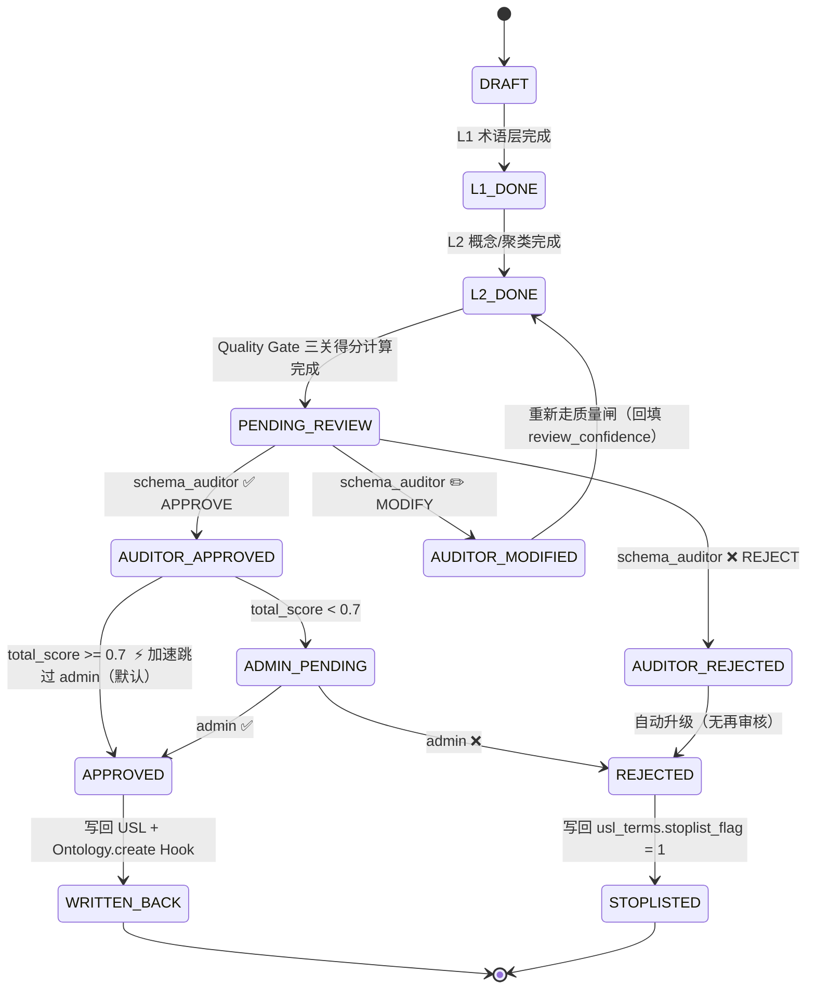

# Data Model: 语义层管理后台 (Semantic Admin Suite)

**Date**: 2026-07-12
**Feature**: 007-semantic-admin-suite
**权威来源**: specs/007-semantic-admin-suite/design/02-iter1-usl-design.html + 03-iter2-ol-pipeline-design.html + 04-iter3-quality-approval-design.html + 05-iter4-writeback-cleanup-design.html

---

## ⚠️ Iter 4 特性（本文件 §3 / §6 相关）

以下能力属于 **Iter 4 写回+清理阶段**，Iter 1~3 不实现：

| 能力 | 说明 | 依赖 |
|------|------|------|
| §3 Neo4j 双写 | USL 分类层级 / Candidate 节点同步写入 Neo4j `USL__*` 命名空间 | Neo4j `bolt://graphiti-neo4j:7687` 就绪 |
| §6.5 L6 公理层（O(E³)） | 默认关闭，仅 admin 显式开；≥200 Candidate 时预计 10s+ | 质量闸全部通过后 |
| W4 Ontology.create Hook 失败重试 | USL 写回成功但 Ontology TBox 失败时，不回滚 USL；标记失败状态 + 30min 重试 1 次 | Hook 系统就绪 |

---

## 📋 目录与表总览

**表总数**：**11 张**（6 USL 核心表 + 5 Pipeline 表）

| 组 | 表名（复数） | 所属模块 | DDL 来源 |
|----|--------------|----------|----------|
| **USL 核心（6 张）** | `usl_domains` | usl_manager | 02-iter1 §② |
| | `usl_terms` | usl_manager | 02-iter1 §② |
| | `usl_hierarchies` | usl_manager | 02-iter1 §②（原名 usl_hierarchy，统一复数） |
| | `usl_property_specs` | usl_manager | 02-iter1 §② |
| | `usl_disjoint_pairs` | usl_manager | 02-iter1 §② |
| | `usl_cardinalities` | usl_manager | 02-iter1 §②（原名 usl_cardinality，统一复数） |
| **Pipeline（5 张）** | `usl_pipeline_runs` | ol_pipeline | 03-iter2 §③a |
| | `usl_schema_candidates` | candidate_store | 03-iter2 §③a |
| | `usl_pipeline_layer_snapshots` | ol_pipeline | 03-iter2 §③a（额外表） |
| | `usl_quality_reports` | quality_gate | 04-iter3 §⑤（原 quality_scores） |
| | `usl_approval_records` | approval_workflow | 04-iter3 §⑤（原 approvals） |

*注：原 scaffold 草稿 12 张表中的 `usl_dashboard_daily_snapshots` 已**移除**；日汇总改为 **quality_gate/services/dashboard_query_service.py** 只读聚合层 + SQLite 覆盖索引。*

*SQLite 强制执行约束（AGENTS.md 规则 8）：每次 `sqlite3.connect()` → 用完立即 `conn.close()`（无连接池）；Dict/List 以 JSON TEXT 列存；Enum 一律以 `.value` 字符串存；datetime 一律存 ISO8601 字符串。*

---

## 1. USL 核心表 DDL（6 张）

> 来源：02-iter1-usl-design.html §② DDL（统一表名为复数形式）

### 1.1 usl_domains（语义域）

```sql
CREATE TABLE IF NOT EXISTS usl_domains (
    id              TEXT PRIMARY KEY,             -- uuid
    code            TEXT UNIQUE NOT NULL,         -- 'sanguo' / 'xiyou' / 'auto_b2b2c'
    display_name    TEXT NOT NULL,                -- 显示名（中文）
    description     TEXT,
    en_mapping_json TEXT NOT NULL DEFAULT '{}',   -- JSON TEXT: {中文名:英文名, 势力:Faction}
    created_at      TEXT NOT NULL,
    updated_at      TEXT NOT NULL
);
```

### 1.2 usl_terms（规范术语）

```sql
CREATE TABLE IF NOT EXISTS usl_terms (
    id              TEXT PRIMARY KEY,
    domain_id       TEXT NOT NULL REFERENCES usl_domains(id) ON DELETE CASCADE,
    canonical       TEXT NOT NULL,                -- 规范术语（主键：势力 / 会员）
    semantic_type   TEXT NOT NULL,                -- 对象类型 / 关系类型 / 属性 / 动作类型 / 过程类型 / 规则类型
    definition      TEXT,                         -- 术语定义（可选）
    synonyms_json   TEXT NOT NULL DEFAULT '[]',   -- JSON TEXT 数组：同义词 ['阵营','国家']
    near_syn_json   TEXT NOT NULL DEFAULT '[]',   -- JSON TEXT 数组：近义词
    aliases_json    TEXT NOT NULL DEFAULT '[]',   -- JSON TEXT 数组：别名
    stoplist_flag   INTEGER NOT NULL DEFAULT 0,   -- 1=黑名单（HITL 拒绝后写入）
    UNIQUE(domain_id, canonical)
);
CREATE INDEX IF NOT EXISTS idx_usl_terms_domain ON usl_terms(domain_id);
CREATE INDEX IF NOT EXISTS idx_usl_terms_type   ON usl_terms(semantic_type);
```

*SemanticType 合法枚举（权威集 04 §② G1.3）：`{对象类型, 关系类型, 属性, 动作类型, 过程类型, 规则类型}`（中文 6 值）。*

### 1.3 usl_hierarchies（层级关系 is_a / part_of）

```sql
CREATE TABLE IF NOT EXISTS usl_hierarchies (
    id            TEXT PRIMARY KEY,
    domain_id     TEXT NOT NULL REFERENCES usl_domains(id) ON DELETE CASCADE,
    rel_type      TEXT NOT NULL,                  -- 'is_a' / 'part_of' / 'instance_of'
    parent_term   TEXT NOT NULL,                  -- 父级规范术语
    child_term    TEXT NOT NULL,                  -- 子级规范术语
    confidence    REAL NOT NULL DEFAULT 1.0,      -- 1.0=人工 0.6~0.9=HITL 审核 <0.6=OL 候选未批准
    created_at    TEXT NOT NULL,
    UNIQUE(domain_id, rel_type, parent_term, child_term)
);
CREATE INDEX IF NOT EXISTS idx_hier_domain ON usl_hierarchies(domain_id);
```

### 1.4 usl_property_specs（属性规范）

```sql
CREATE TABLE IF NOT EXISTS usl_property_specs (
    id            TEXT PRIMARY KEY,
    domain_id     TEXT NOT NULL REFERENCES usl_domains(id) ON DELETE CASCADE,
    for_term      TEXT NOT NULL,                  -- 作用在哪个术语（会员 / 车辆，可 '*'=全局）
    prop_name     TEXT NOT NULL,                  -- 属性名：price / phone
    data_type     TEXT NOT NULL,                  -- string / integer / float / boolean / date / datetime / json
    unit          TEXT,                           -- 单位：元、辆、次（可选）
    required_flag INTEGER NOT NULL DEFAULT 0,
    description   TEXT,
    UNIQUE(domain_id, for_term, prop_name)
);
CREATE INDEX IF NOT EXISTS idx_spec_domain    ON usl_property_specs(domain_id);
CREATE INDEX IF NOT EXISTS idx_spec_for_term  ON usl_property_specs(for_term);
```

### 1.5 usl_disjoint_pairs（不相交约束）

```sql
CREATE TABLE IF NOT EXISTS usl_disjoint_pairs (
    id          TEXT PRIMARY KEY,
    domain_id   TEXT NOT NULL REFERENCES usl_domains(id) ON DELETE CASCADE,
    term_a      TEXT NOT NULL,
    term_b      TEXT NOT NULL,
    reason      TEXT,                             -- 理由：会员/车辆语义不交
    UNIQUE(domain_id, term_a, term_b)
);
CREATE INDEX IF NOT EXISTS idx_dj_domain ON usl_disjoint_pairs(domain_id);
```

### 1.6 usl_cardinalities（关系基数）

```sql
CREATE TABLE IF NOT EXISTS usl_cardinalities (
    id          TEXT PRIMARY KEY,
    domain_id   TEXT NOT NULL REFERENCES usl_domains(id) ON DELETE CASCADE,
    rel_name    TEXT NOT NULL,                    -- 关系类型：拥有 / 销售
    domain_term TEXT NOT NULL,                    -- 域术语：会员
    range_term  TEXT NOT NULL,                    -- 值域术语：车辆
    min_card    INTEGER NOT NULL DEFAULT 0,
    max_card    INTEGER,                          -- NULL = 无限
    UNIQUE(domain_id, rel_name, domain_term, range_term)
);
CREATE INDEX IF NOT EXISTS idx_card_domain ON usl_cardinalities(domain_id);
CREATE INDEX IF NOT EXISTS idx_card_rel    ON usl_cardinalities(rel_name);
```

---

## 2. Pipeline 表 DDL（5 张）

> 来源：03-iter2-ol-pipeline-design.html §③a + 04-iter3-quality-approval-design.html §⑤

### 2.1 usl_pipeline_runs（流水线运行记录）

```sql
CREATE TABLE IF NOT EXISTS usl_pipeline_runs (
    id              TEXT PRIMARY KEY,
    domain_id       TEXT,                       -- 可选，用户未选则为 NULL
    workspace_id    TEXT NOT NULL,
    doc_sources_json TEXT NOT NULL,             -- JSON: [{source, title, url, checksum}]
    status          TEXT NOT NULL,              -- DRAFT / RUNNING / L1_DONE / L2_DONE / L3_DONE / L4_DONE / L5_DONE / L6_DONE / FAILED / COMPLETED
    started_at      TEXT NOT NULL,
    finished_at     TEXT,
    error_message   TEXT,
    stats_json      TEXT NOT NULL DEFAULT '{}'  -- 每一层候选数统计 JSON
);
```

### 2.2 usl_schema_candidates（Schema 候选 · 核心表）

```sql
CREATE TABLE IF NOT EXISTS usl_schema_candidates (
  id                     TEXT PRIMARY KEY,
  run_id                 TEXT NOT NULL REFERENCES usl_pipeline_runs(id) ON DELETE CASCADE,
  canonical              TEXT NOT NULL,
  en                     TEXT NOT NULL DEFAULT '',
  semantic_type          TEXT NOT NULL,              -- 对象类型/关系类型/属性/动作类型/过程类型/规则类型
  synonyms_json          TEXT NOT NULL DEFAULT '[]',
  aliases_json           TEXT NOT NULL DEFAULT '[]',
  origin                 TEXT NOT NULL,               -- usl | llm | hybrid | human
  cluster_confidence     REAL NOT NULL DEFAULT 0,     -- L2 HDBSCAN 聚类置信度
  usl_align_confidence   REAL NOT NULL DEFAULT 0,     -- 与 USL 对齐程度（反向=新颖度）
  review_confidence      REAL NOT NULL DEFAULT 0,     -- Iter 3 审批后人工写入
  status                 TEXT NOT NULL DEFAULT 'DRAFT',
  -- 状态机（见 §5）: DRAFT → L1_DONE → L2_DONE → PENDING_REVIEW → AUDITOR_APPROVED/REJECTED/MODIFIED
  --        → ADMIN_PENDING(条件 <0.7) → APPROVED/REJECTED → WRITTEN_BACK / STOPLISTED
  domain_id              TEXT,
  doc_refs_json          TEXT NOT NULL DEFAULT '[]',  -- JSON: [{doc_title, snippet_ref}]
  parent_candidates_json TEXT NOT NULL DEFAULT '[]',  -- JSON: [parent_candidate_id...]
  created_at             TEXT NOT NULL,
  updated_at             TEXT NOT NULL
);
CREATE INDEX IF NOT EXISTS idx_cand_run      ON usl_schema_candidates(run_id);
CREATE INDEX IF NOT EXISTS idx_cand_status   ON usl_schema_candidates(status);
CREATE INDEX IF NOT EXISTS idx_cand_sem_type ON usl_schema_candidates(semantic_type);
```

### 2.3 usl_pipeline_layer_snapshots（层间快照 · 调试用）

```sql
CREATE TABLE IF NOT EXISTS usl_pipeline_layer_snapshots (
  id           TEXT PRIMARY KEY,
  run_id       TEXT NOT NULL REFERENCES usl_pipeline_runs(id) ON DELETE CASCADE,
  layer_name   TEXT NOT NULL,   -- L1/L2/L3/L4/L5/L6
  input_json   TEXT NOT NULL,
  output_json  TEXT NOT NULL,
  duration_ms  INTEGER NOT NULL,
  created_at   TEXT NOT NULL
);
```

### 2.4 usl_quality_reports（质量闸三关报告）

```sql
CREATE TABLE IF NOT EXISTS usl_quality_reports (
  id              TEXT PRIMARY KEY,
  candidate_id    TEXT NOT NULL REFERENCES usl_schema_candidates(id) ON DELETE CASCADE,
  gate1_score     REAL NOT NULL,   -- 0~1  Gate1 句法/结构
  gate1_details   TEXT NOT NULL,   -- JSON，7 子项
  gate2_score     REAL NOT NULL,   -- 0~1  Gate2 语义一致
  gate2_details   TEXT NOT NULL,   -- JSON，4 子项
  gate3_score     REAL NOT NULL,   -- 0~1  Gate3 领域质量
  gate3_details   TEXT NOT NULL,   -- JSON，5 子项
  total_score     REAL NOT NULL,   -- 0~1   线性加权
  tier            TEXT NOT NULL,   -- HIGH/MEDIUM/LOW/VERY_LOW
  created_at      TEXT NOT NULL
);
CREATE INDEX IF NOT EXISTS idx_qr_cand  ON usl_quality_reports(candidate_id);
CREATE INDEX IF NOT EXISTS idx_qr_tier  ON usl_quality_reports(tier);
CREATE INDEX IF NOT EXISTS idx_qr_total ON usl_quality_reports(total_score);
```

*质量闸公式见 §4；得分公式、权重、子项数量以本节为准。*

### 2.5 usl_approval_records（2 级审批流水）

```sql
CREATE TABLE IF NOT EXISTS usl_approval_records (
  id              TEXT PRIMARY KEY,
  candidate_id    TEXT NOT NULL REFERENCES usl_schema_candidates(id) ON DELETE CASCADE,
  approver_id     TEXT NOT NULL,            -- user.id
  approver_role   TEXT NOT NULL,            -- schema_auditor | admin
  workspace_id    TEXT NOT NULL,
  action          TEXT NOT NULL,            -- APPROVE | REJECT | MODIFY | COMMENT
  before_status   TEXT NOT NULL,
  after_status    TEXT NOT NULL,
  review_score    REAL,                     -- 审核者人工打分 0~1
  comment         TEXT,                     -- MODIFY/REJECT 时必填
  changes_json    TEXT NOT NULL DEFAULT '{}', -- MODIFY 时的字段变更 diff
  created_at      TEXT NOT NULL
);
CREATE INDEX IF NOT EXISTS idx_appr_cand ON usl_approval_records(candidate_id);
CREATE INDEX IF NOT EXISTS idx_appr_user ON usl_approval_records(approver_id);
```

---

## 3. Neo4j 双写（Iter 4 特性）

> 来源：03-iter2-ol-pipeline-design.html §③b Neo4j 双写 + 05-iter4 §① 写回规则
> **Iter 1~3 不启用**。启用条件：`SEMANTIC_ADMIN_NEO4J_DUALWRITE=true`。

### 3.1 命名空间：`USL__*` 前缀（同一 DB 实例，Cypher 过滤）

```cypher
// 语义域节点
(:USL__Domain {id, code, display_name})

// 规范术语节点（同步自 usl_terms + usl_hierarchies）
(:USL__Term {canonical, semantic_type, domain_code})

// Candidate 节点（同步自 usl_schema_candidates）
(:USL__Candidate {id, canonical, semantic_type, origin, status, total_score})
```

### 3.2 双写失败策略

- SQLite 写入成功 → 尝试 Neo4j 写入（`try/except`，失败仅 `log.warning`，不抛异常）
- Candidate 状态变更为 `WRITTEN_BACK` / `STOPLISTED` 时，触发 Neo4j 同步
- 失败重试：后台 30 min **重试一次**，再失败由 admin 手动触发 `POST /api/semantic-admin/admin/resync-neo4j`

---

## 4. 质量闸公式（G1×7 / G2×4 / G3×5，权重 0.35/0.40/0.25）

> 来源：04-iter3-quality-approval-design.html §② 三关质量闸 + §③ 权重与分层
> 本章节为**唯一权威**质量闸定义；任何冲突以本节为准。

### 4.1 总得分公式

```
total_score = w1 × gate1_score + w2 × gate2_score + w3 × gate3_score
            = 0.35 × gate1_score + 0.40 × gate2_score + 0.25 × gate3_score
```

### 4.2 分层阈值

| tier | total_score 区间 | 审核台颜色 | 自动审批规则 |
|------|:---------------:|-----------|-------------|
| **HIGH**      | ≥ 0.85         | 🟢 绿色 | 默认 **不** 自动全审批（阈值默认关闭，需 `SEMANTIC_ADMIN_AUTO_APPROVE_HIGH=true` 才启用，防误报） |
| **MEDIUM**    | [0.70, 0.85)   | ⚪ 白色 | AUDITOR_APPROVED 且 ≥0.7 ⚡ **跳过 admin**（默认开启，可配置） |
| **LOW**       | [0.50, 0.70)   | 🟡 黄色 | AUDITOR_APPROVED → ADMIN_PENDING → admin 终批 |
| **VERY_LOW**  | < 0.50         | ⚫ 灰色 | 建议直接 REJECTED → STOPLISTED |

*阈值默认值可由 BaseSettings 全局调整：`SEMANTIC_ADMIN_GATE_WEIGHTS = '0.35,0.40,0.25'` / `SEMANTIC_ADMIN_ADMIN_SKIP_THRESHOLD = 0.7` / `SEMANTIC_ADMIN_AUTO_APPROVE_HIGH = false`*

### 4.3 Gate 1 · 句法/结构闸（7 子项，w1 = 0.35）

| 编号 | 子指标 | 阈值 | 失败动作 | 扣分项 |
|------|--------|------|---------|--------|
| G1.1 | 名称合规（正则：`^[\u4e00-\u9fa5A-Za-z0-9_.-]{1,40}$`） | 布尔 | FAIL | -0.35 |
| G1.2 | en_mapping 可用（非空且 PascalCase） | 布尔 | WARN，USL 回退补全 | -0.08 |
| G1.3 | semantic_type ∈ 合法 6 枚举 | 布尔 | FAIL，改回默认"对象类型" | -0.15 |
| G1.4 | 同义词集大小 ∈ [0, 30] | 布尔 | WARN，截断前 30 个 | - |
| G1.5 | 同义词去重率 | ≥ 0.98 | WARN，自动去重 | - |
| G1.6 | canonical 与同义词无互相包含环 | 布尔 | WARN，自动剔除 | - |
| G1.7 | 与 USL 同名冲突检查（去重） | 布尔 | INFO，合并 origin=usl | - |

### 4.4 Gate 2 · 语义一致性闸（4 子项，w2 = 0.40）

| 编号 | 子指标 | 阈值 | 失败动作 | 扣分项 |
|------|--------|------|---------|--------|
| G2.1 | USL Disjointness 不相交检查 | 布尔 | FAIL | -0.40 |
| G2.2 | 基数约束检查 | min=0, max=NULL | WARN，每超 10% | -0.06/次 |
| G2.3 | is_a 无环检查（L3 草稿拓扑排序） | 布尔 | FAIL，列出环边 | -0.20 |
| **G2.4** | **LLM Judge 语义一致性（可选，默认关闭）** | yes/no | WARN，no 时 | -0.05/次 |

*⚠️ G2.4 默认关闭（`SEMANTIC_ADMIN_ENABLE_LLM_JUDGE=false`）；开启后单次约 +3~10s 延迟，仅 admin 手动开启。*

### 4.5 Gate 3 · 领域质量闸（5 子项，w3 = 0.25）

Gate 3 内部连续分加权（子权重合计 1.00）：

```
gate3_score = 0.30×G3.1 + 0.20×G3.2 + 0.15×G3.3 + 0.15×G3.4 + 0.20×G3.5
```

| 编号 | 子指标 | 连续分公式 | 子权重 |
|------|--------|-----------|-------|
| G3.1 | 属性密度 | `s = min(1, 关系类型出现次数 / 5)` | 0.30 |
| G3.2 | 词频覆盖率 | `s = min(1, doc_hits / 10)` | 0.20 |
| G3.3 | 同义词丰富度 | `s = min(1, (同义词数+近义词数+别名数) / 5)` | 0.15 |
| G3.4 | USL 对齐率（反向=新颖度） | `s = 1 − usl_align_confidence` | 0.15 |
| G3.5 | 层级贡献度 | `s = min(1, number_of_L3_children_estimation / 3)` | 0.20 |

---

## 5. SchemaCandidate 状态机（10 状态 · 2 级审批）

> 来源：04-iter3-quality-approval-design.html §① 审批状态机



### 5.1 事件-动作矩阵

| 当前状态 | 触发事件 | 目标状态 | 所需角色 | 副作用 |
|---------|---------|---------|---------|-------|
| PENDING_REVIEW | audit_approve | AUDITOR_APPROVED | schema_auditor | review_confidence=1.0；score≥0.7 则直接 → APPROVED |
| PENDING_REVIEW | audit_reject  | AUDITOR_REJECTED | schema_auditor | - |
| PENDING_REVIEW | audit_modify  | AUDITOR_MODIFIED | schema_auditor | changes_json 记录 diff |
| AUDITOR_APPROVED | score<0.7 + admin_pending | ADMIN_PENDING | 系统自动 | - |
| ADMIN_PENDING | admin_approve | APPROVED    | admin | - |
| ADMIN_PENDING | admin_reject  | REJECTED    | admin | - |
| APPROVED | writeback_success | WRITTEN_BACK | 系统 Hook | usl 写入 + Neo4j 同步（Iter4） |
| REJECTED | stoplist_write  | STOPLISTED  | 系统 Hook | stoplist_flag=1 |

---

## 6. OL Pipeline 六层说明

> 来源：03-iter2-ol-pipeline-design.html §① 六层流水线
> Iter 2 交付 **L1 + L2**；Iter 4 交付 **L3 + L4 + L5 + L6（L6 默认关）**

| 层 | 名称 | 输入 | 核心算法 | 输出 | 交付迭代 |
|----|------|------|---------|------|---------|
| L1 | 术语层 | 文档切分 → token | Jieba + USL 词典 + 停用词过滤 | Raw terms + TF | **Iter 2** |
| L2 | 概念层 / 聚类 | L1 terms | HDBSCAN（自动簇数，无预设 k）+ Embedding（LLM 统一 Client） | Clusters → Candidates(canonical, synonyms, en) | **Iter 2** |
| L3 | 分类层 | L2 Candidates | 自顶向下 is_a 归纳（与 USL hierarchies 对齐） | Parent-child 草稿层级 | Iter 4 |
| L4 | 关系层 | L3 + 文档 co-occur | 关联规则 + domain/range 语义过滤 | Relation candidates | Iter 4 |
| L5 | 模式层 | L4 relations | Cardinality + Disjointness 归纳 | usl_cardinalities / usl_disjoint_pairs 草稿 | Iter 4 |
| **L6** | **公理层（默认关）** | L3~L5 全体 | OWL RL 闭包（复杂度 O(E³)） | Axioms（等价/互逆/传递…） | **Iter 4 · 默认禁用** |

*L6 启用条件：`SEMANTIC_ADMIN_ENABLE_AXIOM_LAYER=true`；≥200 candidates 时预计 10s+，仅小数据集验证时开启。*
